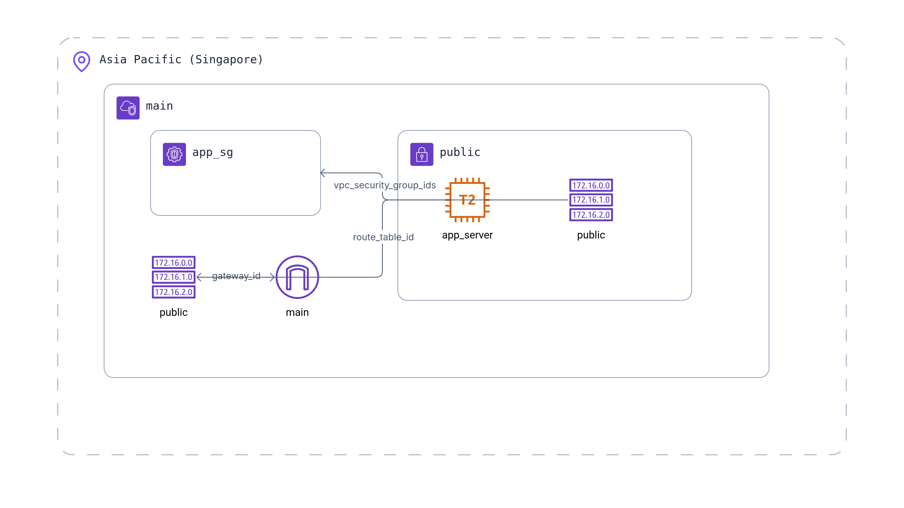

# Visa Check

A web application to help travelers check which countries they can visit based on their nationality and existing visas.

## Features

- **Visa Eligibility Checker**: Check which countries you can visit based on your citizenship
- **Interactive World Map**: Visualize where you can travel with color-coded access types
- **Travel Planning**: Plan international trips based on your visa eligibility

## Technology Stack

- **Framework**: Next.js with App Router
- **Styling**: Tailwind CSS
- **UI Components**: ShadCN UI
- **Data Fetching**: TanStack Query (React Query)
- **Form Handling**: React Hook Form
- **Package Manager**: PNPM

## Getting Started

### Prerequisites

- Node.js 18.17 or later
- PNPM package manager

### Installation

1. Clone the repository:

```bash
git clone <repository-url>
cd visa-check-yo
```

2. Install dependencies:

```bash
pnpm install
```

3. Start the development server:

```bash
pnpm dev
```

4. Open [http://localhost:3000](http://localhost:3000) in your browser to see the application.

4.1. Can also update host file and run `pnpm run dev:https` to open in `https://visa-check.local:3000/`

## Project Structure

- `app/`: Next.js App Router pages and layouts
- `components/`: Reusable UI components
  - `layout/`: Layout components like Header and Footer
  - `ui/`: ShadCN UI components
- `lib/`: Utility functions and shared code
- `public/`: Static assets

## Infrastructure Management (Terraform)

All infrastructure code is located in the `infra/` directory. You can run Terraform commands from the project root by specifying the directory:

```bash
# Initialize Terraform (run once)
terraform -chdir=infra init

# See what changes will be made
terraform -chdir=infra plan

# Apply changes to your infrastructure
terraform -chdir=infra apply

# Show current infrastructure state
terraform -chdir=infra show

# Destroy all resources created by Terraform
terraform -chdir=infra destroy

# Check the public_ip address of the instance
terraform -chdir=infra output public_ip
```

## Deployment

```
$ ./infra/deploy.sh $(terraform -chdir=infra-lightsail output -raw public_ip)
```

## Infrastructure Diagram



**Note:**

- Store sensitive variables (like AWS keys) outside of version control.
- Update `infra/terraform.tfvars` with your own values before applying.

## Terraform (Lightsail)

```
terraform -chdir=infra-lightsail apply
terraform -chdir=infra-lightsail output public_ip
```

## Future Integrations

The application is designed to be easily extended with:

- Database integration (Supabase, Prisma, etc.)
- Authentication system
- Map visualization libraries
- Country and visa data APIs

## License

MIT
